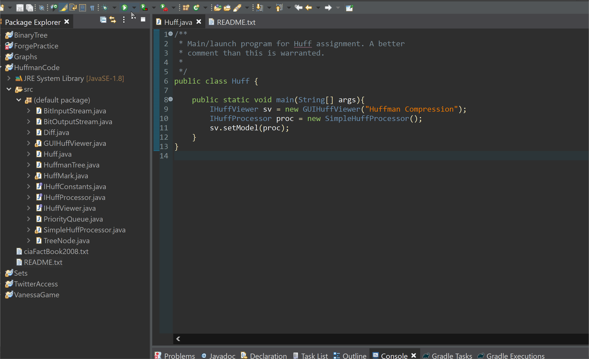

# Huffman_Coding

In this project, we implement the miminal prefix coding algorithm that produces a lossless compression of a file also known as Huffman Coding; the initial idea was created by David Huffman. In this implentation we follow a basic algorithm that scans a file and determines the frequency of all values. Next we use a priority queue to sort the characters in the file based on the frequency. Afterwards a binary tree is created from the priority queue where the higher frequency characters are near the top. Finally we can travel through the binary tree and scan the dtat sctructure to build a new file with the encoding of the original file. Overall the concept from David Huffman is very useful to learnign about data transmission and statistical coding.

## Display of Project

### Compression
We will be compressing the CIA Fact Book of 2008 that is made up of 28,867,432 bits using the Standard Count Format (SCF) header. After the compression process the compressed file will be made up of 552,061 bits, that is roughly 2% of the size of the original file.

### Decompression
We can also decompressed a file that has been compressed to return it to its original state. Here we take the compressed CIA Fact document that is 552,061 bits and decode the file to the original state of 28,867,432 bits.

## Key Feautures

- Programmed in Java
- Used Priority Queue Implementations
- Used Binary Tree Implementations
- Created and Utilized Recursive Functions 

## Data Structure Class

This course deepened my knowledge of software design through the lenses of an object-oriented perspective. I learned to implemented commmon data structures to organize and manipulate data such as linked lists, recursion, binary trees, and hash tables to list a few. I was made aware of the tradeoffs software developers have to deal with when designing projects and how to handle them. The class also allowed students to explore algorithms and structures in standard code.
